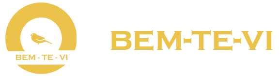

  

## Bem vindos a Bem-Te-Vi ✨

Somos alunos do Instituto Proa, cursando o ProProfissão 4.0 e estamos desenvolvendo esse projeto para impactar e ajudar a sociedade como um todo.
Como tema do projeto, **Ajudar o Mercado Local**.

## Integrantes do Projeto 👥
- Ana Carolina Oliveira dos Santos; [Github](https://github.com/AnaCarolina6926)
- Gabriel Henrique Gonçalves; [Github](https://github.com/Gabriel-Goncalves382)
- Guilherme Gomes Bravo; [Github](https://github.com/guilherme-bravo)
- Isabella Alves de Queiroz Moura;
- João Victor Soares Dias; [Github](https://github.com/Joo-Dias)
- Lucas de Carvalho Cabaleiro; [Github](https://github.com/olucas07)
- Lucas Eduardo Lisboa Freitas Rocha;
- Luís Gabriel da Silva;

## Tudo isso só foi possível por causa do Instituto Proa 💙

